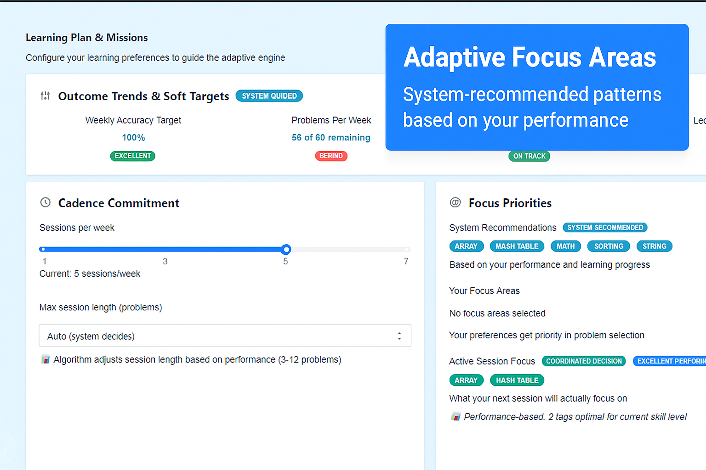
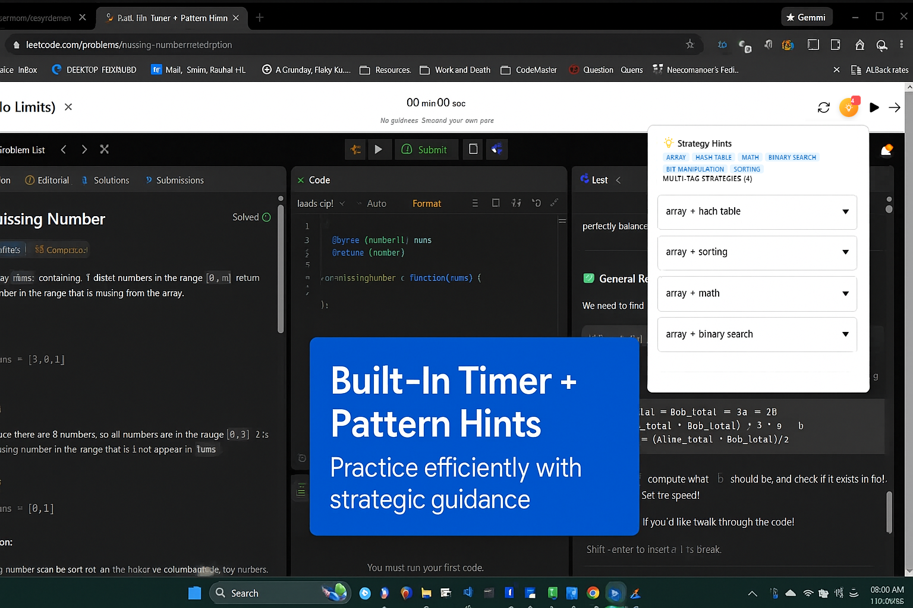
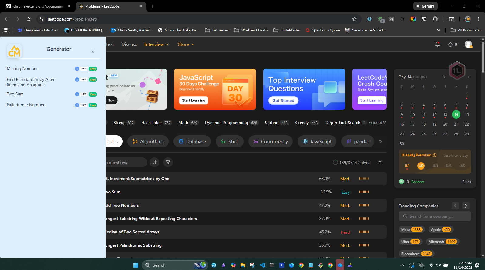
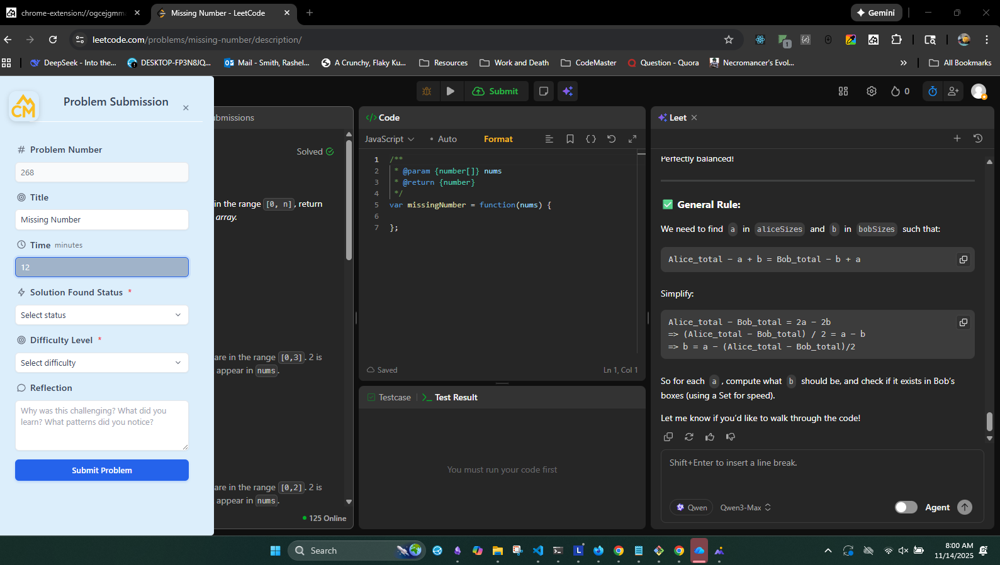
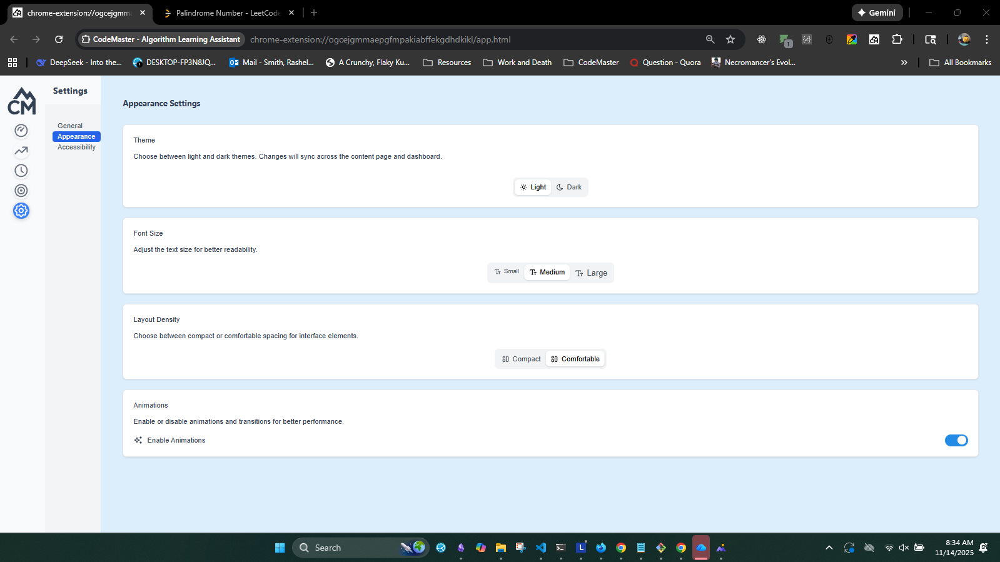

# 🧠 CodeMaster: Algorithm Mastery Assistant

**CodeMaster** is a personalized learning and productivity Chrome Extension that helps developers master data structures and algorithms through a smart, pattern-based spaced repetition system. It integrates with platforms like LeetCode to track your progress, adapt your sessions, and reinforce long-term retention using the Leitner system and pattern ladders.

---

## 🚀 Key Features

- 🔁 **Leitner System** for spaced repetition of problems using box levels and cooldown logic
- 🧠 FSRS (Forgetting Spaced Repetition Scheduling) support for better long-term retention
- 🧩 **Pattern Ladders** to guide progression through algorithm types with tag-aware difficulty scaling
- 📊 **Dashboard Analytics** with Recharts: tag mastery, box distribution, session trends, and problem activity
- 📈 **Adaptive Sessions** that adjust based on your tag performance, session results, and recent inactivity
- 🧠 **Tag Mastery Engine** tracking ladder completion, problem success rates, and decay scores
- 🧰 **Extension Mode** overlays Codemaster on LeetCode for in-browser problem capturing and annotation

---

## 📸 Screenshots

### Dashboard Analytics & Progress

*Track your progress with comprehensive analytics: tag mastery, problem distribution, and session trends*


*Visualize your learning journey through pattern ladders and algorithm progression*

### Learning Goals & Focus Areas

*Set personalized learning goals and track tag-specific mastery levels*

### LeetCode Integration

*Seamlessly integrated with LeetCode - track problems, hints, and timer directly on the platform*


*Built-in timer with smart hints system to guide you when stuck*

### Problem Management

*Adaptive session generation based on your performance and learning patterns*


*Track attempts, perceived difficulty, and notes for every problem you solve*

### Settings & Customization

*Customize your learning experience with adaptive session controls and preferences*

---

## 🔧 Installation

### Prerequisites

- **Node.js** (v16 or higher) - [Download here](https://nodejs.org/)
- **Google Chrome** browser with Developer Mode enabled
- **Git** for version control

### Quick Start

1. **Clone the repository**
   ```bash
   git clone https://github.com/smithrashell/CodeMaster.git
   cd CodeMaster
   ```

2. **Install dependencies**
   ```bash
   cd chrome-extension-app
   npm install
   ```

3. **Build the extension**
   ```bash
   # Development build with watch mode
   npm run dev
   
   # Or production build
   npm run build
   ```

4. **Load the extension in Chrome**
   - Open Chrome and navigate to `chrome://extensions/`
   - Enable **Developer mode** (toggle in top right)
   - Click **Load unpacked**
   - Select the `chrome-extension-app/dist` folder
   - The CodeMaster extension should now appear in your extensions

5. **Start developing**
   - Visit [LeetCode](https://leetcode.com/problemset/algorithms/) to see the extension in action
   - Use the extension popup or standalone dashboard for full functionality

### Development Commands

```bash
# Chrome extension development (run from chrome-extension-app/ directory)
npm run dev          # Development build with watch mode
npm run build        # Production build
npm run lint         # Code linting
npm run lint:fix     # Auto-fix linting issues
npm run test         # Run test suite
npm run test:watch   # Run tests in watch mode
npm run format       # Format code with Prettier
```

## 🧪 Testing Framework

CodeMaster includes a comprehensive testing framework with automatic database isolation and snapshot-based state management.

### Quick Testing

```javascript
// Browser console (after loading extension)
setupTests()                    // Start test session
runMultipleTests()             // Run all tests with auto-isolation
endTestSession()               // Clean up when done
```

### Advanced Testing

```javascript
// Start test session with options
await enableTesting({
  mode: 'session',         // 'session' | 'single' | 'persistent'
  seedLevel: 'full',       // 'minimal' | 'standard' | 'full'
  autoSnapshot: true       // Create baseline snapshots for fast isolation
})

// Run specific tests
await runMultipleTests(['minimal', 'core', 'relationships'])

// Individual test execution
await testCoreBusinessLogic()
await testMinimal()

// Session management
getTestSessionInfo()           // Check session status
await endTestSession()         // Clean up and restore production mode
```

### Key Features

- **🚀 Efficient**: One-time database seeding per session (not per test)
- **⚡ Fast Isolation**: Snapshot-based restoration vs rebuilding relationships
- **🤖 Automatic**: No manual state management required
- **🔒 Safe**: Production database never touched during testing
- **📊 Comprehensive**: Tests all core business logic, relationships, and adaptive algorithms

### Project Structure

```
CodeMaster/
├── chrome-extension-app/    # Chrome extension source code
│   ├── src/
│   │   ├── app/             # Standalone dashboard application
│   │   ├── content/         # LeetCode page integration
│   │   ├── popup/           # Extension popup interface
│   │   └── shared/          # Shared utilities, services, components
│   ├── public/              # Extension manifest and assets
│   └── dist/                # Built extension files (load this in Chrome)
├── docs/                    # Comprehensive documentation hub
│   ├── getting-started/     # Installation and quick start guides
│   ├── architecture/        # System design and technical architecture
│   ├── development/         # Contributing, coding standards, testing
│   ├── features/           # Learning algorithms and system features
│   ├── api/                # Service and database API references
│   └── troubleshooting/    # Common issues and solutions
└── README.md               # Project overview and quick navigation
```

### Next Steps

- 📖 **[Complete Documentation Hub](docs/README.md)** - Comprehensive technical documentation and guides
- 🚀 **[Quick Start Installation](docs/getting-started/installation.md)** - Get running in 15 minutes
- 🏗️ **[Architecture Overview](docs/architecture/overview.md)** - Understand the system design
- 🤝 **[Contributing Guide](CONTRIBUTING.md)** - Developer workflow, CLA, and standards
- 🛠️ **[API References](docs/api/)** - Services and database API documentation
- 🎯 **[Learning Features](docs/features/)** - Leitner system, adaptive sessions, pattern ladders
- 🐛 **[Troubleshooting](docs/troubleshooting/)** - Common issues and solutions

---

## 📜 License

CodeMaster is licensed under the **GNU Affero General Public License v3.0 (AGPL-3.0)**.

### What This Means

✅ **You can:**
- Use CodeMaster for personal or commercial purposes
- Modify the source code
- Distribute modified versions
- Contribute to the project

⚠️ **You must:**
- Share source code of modified versions under AGPL v3
- Preserve copyright and license notices
- State changes made to the code
- Make source code available to network users (if you host a modified version)

❌ **You cannot:**
- Relicense under different terms (without permission)
- Hold the author liable for damages
- Use CodeMaster trademarks without permission

### Commercial Licensing

For businesses that cannot comply with AGPL v3 requirements (e.g., proprietary modifications, no source disclosure), **alternative commercial licenses** are available.

**Contact**: RashellSSmith@gmail.com for commercial licensing inquiries.

### Contributing

By contributing code to CodeMaster, you agree to our [Contributor License Agreement](CONTRIBUTING.md#contributor-license-agreement-cla), which allows us to:
- Offer dual licensing (AGPL v3 + commercial)
- Enforce copyright protection
- Maintain project flexibility

See [CONTRIBUTING.md](CONTRIBUTING.md) for full details.

---

**Copyright (C) 2025 Rashell Smith**

See [LICENSE](LICENSE) for the complete license text.

