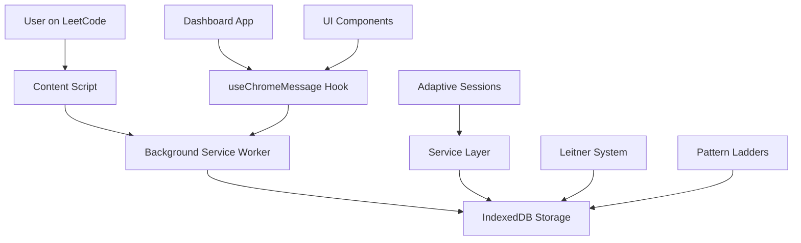

# CodeMaster Documentation Hub

Welcome to the CodeMaster documentation! This comprehensive guide will help you understand, contribute to, and extend the CodeMaster algorithm learning system.

## 🚀 New Contributors Start Here

**Quick Start (15 minutes to running extension):**
1. [Installation & Setup](getting-started/environment-setup.md) - Get CodeMaster running locally
2. [Architecture Overview](architecture/overview.md) - Understand the core system design
3. [Development Workflow](development/contributing.md) - Learn how to contribute effectively

**New to the codebase?** Follow this learning path:
1. Start with the [Chrome Extension Architecture](architecture/chrome-extension.md) to understand how everything connects
2. Explore the [Database Schema](architecture/database-schema.md) to understand data relationships
3. Review the [Service Layer](architecture/service-layer.md) to understand business logic organization

## 📖 Core Systems Documentation

### 🏗️ Architecture & Design

| Document | Purpose | Key Topics |
|----------|---------|------------|
| [Architecture Overview](architecture/overview.md) | High-level system design | Components, data flow, technology stack |
| [Chrome Extension Architecture](architecture/chrome-extension.md) | Extension-specific architecture | Entry points, messaging, content scripts |
| [Database Schema](architecture/database-schema.md) | Complete IndexedDB structure | 13 stores, relationships, migrations |
| [Service Layer](architecture/service-layer.md) | Business logic organization | 17 services, patterns, integration |
| [Session Management](architecture/session-management.md) | Session lifecycle & analytics | Creation, tracking, completion |
| [Chrome API Usage](architecture/chrome-api-usage.md) | Chrome extension integration | Messaging patterns, permissions, security |

### 🔧 Development & Contributing

| Document | Purpose | Key Topics |
|----------|---------|------------|
| [Contributing Guide](development/contributing.md) | Development workflow | Git workflow, testing, code review |
| [Coding Standards](development/coding-standards.md) | Code style & conventions | ESLint rules, naming patterns, structure |
| [**Testing Framework**](development/testing-framework.md) | **Comprehensive testing system** | **Session management, database isolation, snapshots** |
| [Hooks Implementation](development/hooks-implementation.md) | React hooks patterns | Custom hooks, testing, performance |
| [Component Refactoring](development/component-refactoring.md) | Refactoring guidelines | Patterns, migration strategy, best practices |

### 🎯 Learning Features

| Document | Purpose | Key Topics |
|----------|---------|------------|
| [Leitner Spaced Repetition](features/leitner-system.md) | Spaced repetition system | Box progression, FSRS, scheduling |
| [Adaptive Sessions](features/adaptive-sessions.md) | Personalized learning sessions | Problem selection, difficulty scaling, real-time adaptation |
| [Pattern Ladders](features/pattern-ladders.md) | Progressive skill building | Tag-based progression, difficulty scaling |
| [Strategy Hints](features/strategy-hints.md) | Contextual learning assistance | Hint generation, progressive disclosure |

## 🛠️ API Reference

### Service APIs
- [**Services API Reference**](api/services-api.md) - Complete guide to all 17 business logic services
  - Core Services: ProblemService, SessionService, TagService, AttemptsService
  - Infrastructure: ChromeAPIErrorHandler, IndexedDBRetryService
  - Features: StrategyService, DashboardService, OnboardingService

### Database APIs  
- [**Database API Reference**](api/database-api.md) - Complete IndexedDB layer documentation
  - Store APIs: problems, sessions, attempts, tag_mastery, pattern_ladders
  - Utilities: backupDB, restoreDB, migrations, performance optimization
  - Schema: Relationships, indexes, version management

### Chrome Extension APIs
- **Chrome Messaging Patterns** - useChromeMessage hook, background script handlers
- **Content Script Integration** - LeetCode page interaction, problem extraction  
- **Storage & Permissions** - Chrome storage API, extension permissions

## 🐛 Troubleshooting & Support

| Document | Purpose | When to Use |
|----------|---------|-------------|
| [Common Issues](troubleshooting/common-issues.md) | Frequent problems & solutions | Build errors, extension loading, data issues |
| [Performance Guide](troubleshooting/performance.md) | Performance optimization | Slow queries, memory leaks, Chrome API issues |
| [Emergency Fixes](troubleshooting/emergency-fixes.md) | Critical issue resolution | Production blockers, data corruption, system failures |

## 📊 System Overview

### Technology Stack
- **Frontend**: React 18, Mantine UI, Chrome Extension APIs
- **Database**: IndexedDB with custom abstraction layer
- **Build**: Webpack with dev/prod configurations  
- **Testing**: Advanced framework with snapshot isolation, session management (110+ tests)
- **Algorithms**: FSRS spaced repetition, Leitner system, adaptive difficulty

### Key Statistics
- **13 IndexedDB Stores** - Problems, sessions, analytics, mastery tracking
- **17 Service Modules** - Business logic abstraction layer
- **4 Entry Points** - Popup, content script, background worker, standalone app
- **25 Database Versions** - Iterative schema evolution with migrations
- **110+ Tests** - Comprehensive test coverage across services and components

## 🎯 Learning Algorithms

CodeMaster implements sophisticated learning algorithms:

1. **Leitner Spaced Repetition** - Problems progress through 5 boxes based on mastery
2. **FSRS Scheduling** - Modern spaced repetition with personalized forgetting curves
3. **Pattern Ladders** - Progressive difficulty scaling within algorithm categories
4. **Adaptive Sessions** - Dynamic problem selection based on performance and goals
5. **Tag Mastery Engine** - Tracks learning progress across 50+ algorithm patterns

### Data Flow Architecture

## 🔍 Quick Navigation by Task

### I want to...

**Understand the system:**
- [Architecture Overview](architecture/overview.md) → [Database Schema](architecture/database-schema.md) → [Service Layer](architecture/service-layer.md)

**Add a new feature:**
- [Contributing Guide](development/contributing.md) → [Coding Standards](development/coding-standards.md) → [Services API](api/services-api.md)

**Fix a bug:**
- [Common Issues](troubleshooting/common-issues.md) → [Database API](api/database-api.md) → [Performance Guide](troubleshooting/performance.md)

**Optimize performance:**
- [Performance Guide](troubleshooting/performance.md) → [Database API](api/database-api.md) → [Chrome API Usage](architecture/chrome-api-usage.md)

**Understand learning algorithms:**
- [Leitner System](features/leitner-system.md) → [Adaptive Sessions](features/adaptive-sessions.md) → [Pattern Ladders](features/pattern-ladders.md)

**Work with Chrome extension features:**
- [Chrome Extension Architecture](architecture/chrome-extension.md) → [Chrome API Usage](architecture/chrome-api-usage.md)

## 📚 External Resources

### Development Tools
- **Chrome Extension Development** - [Chrome Developers Guide](https://developer.chrome.com/docs/extensions/)
- **React 18** - [Official React Documentation](https://react.dev/)
- **IndexedDB** - [MDN IndexedDB Guide](https://developer.mozilla.org/en-US/docs/Web/API/IndexedDB_API)
- **Mantine UI** - [Mantine Components](https://mantine.dev/)

### Learning Science
- **Spaced Repetition Research** - [FSRS Algorithm](https://github.com/open-spaced-repetition/fsrs4anki)  
- **Leitner System** - [Original Research](https://en.wikipedia.org/wiki/Leitner_system)
- **Cognitive Load Theory** - [Learning Optimization](https://en.wikipedia.org/wiki/Cognitive_load)

## 📋 Documentation Standards

### Contributing to Documentation

When updating documentation:

1. **Keep it Current** - Update docs with code changes
2. **Use Examples** - Include code examples for APIs
3. **Link Generously** - Cross-reference related concepts
4. **Test Instructions** - Verify setup instructions work
5. **Consider Audience** - Write for the intended reader level

### Documentation Templates

- **API Documentation** - Include purpose, usage, examples, integration
- **Feature Documentation** - Overview, implementation, user experience, configuration
- **Architecture Documentation** - Design decisions, trade-offs, future considerations
- **Troubleshooting** - Problem description, solution steps, prevention tips

## 🤝 Getting Help

### Community Resources
- **Issues** - [GitHub Issues](https://github.com/your-repo/codemaster/issues) for bugs and feature requests
- **Discussions** - [GitHub Discussions](https://github.com/your-repo/codemaster/discussions) for questions and ideas
- **Contributing** - See [Contributing Guide](development/contributing.md) for development workflow

### Maintainer Contact
- **Technical Questions** - Create a GitHub issue with the `question` label
- **Architecture Discussions** - Use GitHub discussions or technical RFC process
- **Security Issues** - Follow responsible disclosure process in contributing guide

---

*This documentation hub is continuously updated to reflect the latest system state. Last updated: $(date +%Y-%m-%d)*

**Getting Started?** → [Environment Setup](getting-started/environment-setup.md)  
**Need Help?** → [Troubleshooting](troubleshooting/common-issues.md)  
**Want to Contribute?** → [Contributing Guide](development/contributing.md)