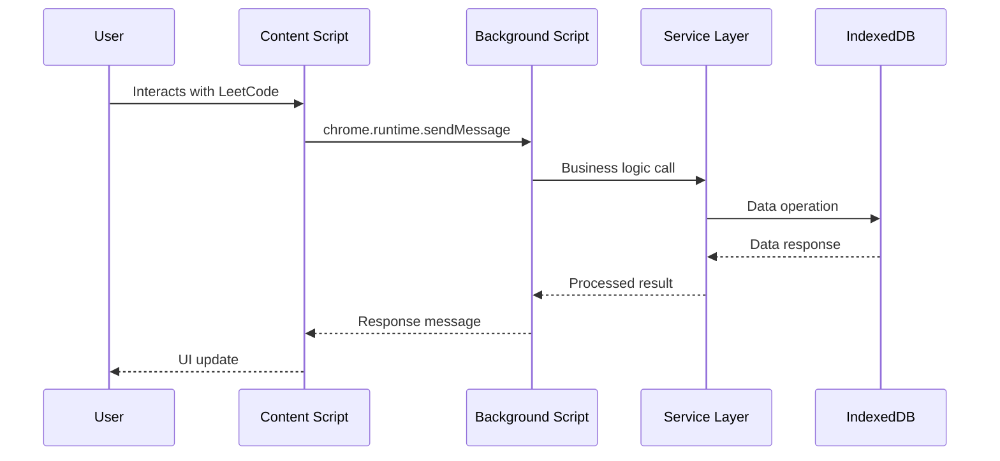
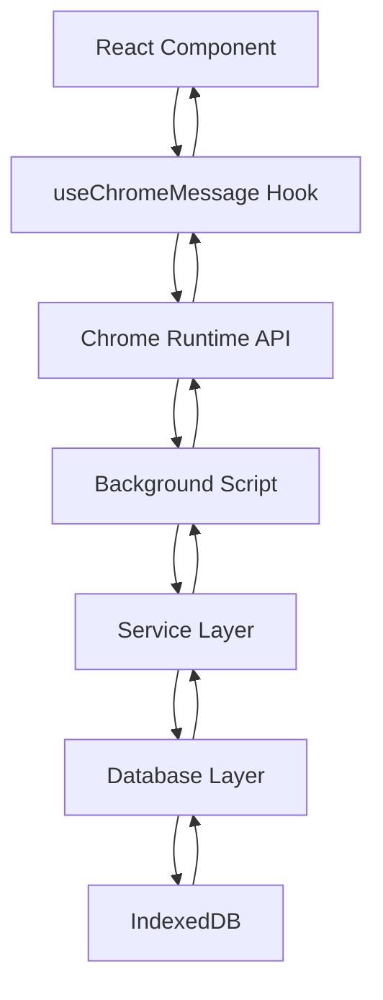

# 🏗️ Architecture Overview

This document provides a high-level overview of CodeMaster's architecture and links to detailed technical documentation.

## 📋 Table of Contents

- [System Architecture](#-system-architecture)
- [Key Design Principles](#-key-design-principles)
- [Architecture Decision Records](#-architecture-decision-records)
- [Component Interaction](#-component-interaction)
- [Data Flow](#-data-flow)
- [Documentation Hub](#-documentation-hub)

---

## 🏛️ System Architecture

CodeMaster follows a **layered Chrome extension architecture** with clear separation of concerns:

```
┌─────────────────────────────────────────────────────────┐
│                    USER INTERFACES                      │
│  ┌─────────────┐ ┌─────────────┐ ┌─────────────────────┐ │
│  │   Content   │ │   Popup     │ │  Standalone App     │ │
│  │   Scripts   │ │ Interface   │ │    Dashboard        │ │
│  │  (LeetCode) │ │ (Quick UI)  │ │ (Full Features)     │ │
│  └─────────────┘ └─────────────┘ └─────────────────────┘ │
└─────────────────────────────────────────────────────────┘
                          │
┌─────────────────────────────────────────────────────────┐
│                PRESENTATION LAYER                       │
│  ┌─────────────────────────────────────────────────────┐ │
│  │         React Components & Custom Hooks            │ │
│  │    • useChromeMessage • useStrategy • useState     │ │
│  └─────────────────────────────────────────────────────┘ │
└─────────────────────────────────────────────────────────┘
                          │
┌─────────────────────────────────────────────────────────┐
│                  BUSINESS LOGIC                         │
│  ┌─────────────────────────────────────────────────────┐ │
│  │              Service Layer (17 Services)           │ │
│  │ ProblemService • SessionService • TagService       │ │
│  │ AttemptsService • ScheduleService • StrategyService │ │
│  └─────────────────────────────────────────────────────┘ │
└─────────────────────────────────────────────────────────┘
                          │
┌─────────────────────────────────────────────────────────┐
│                   DATA ACCESS                           │
│  ┌─────────────────────────────────────────────────────┐ │
│  │            Database Layer Utilities                │ │
│  │     • Transaction Management • Index Creation      │ │
│  │     • Error Handling • Schema Migrations          │ │
│  └─────────────────────────────────────────────────────┘ │
└─────────────────────────────────────────────────────────┘
                          │
┌─────────────────────────────────────────────────────────┐
│                   PERSISTENCE                           │
│  ┌─────────────────────────────────────────────────────┐ │
│  │              IndexedDB (13 Stores)                 │ │
│  │   problems • sessions • attempts • tag_mastery     │ │
│  │   strategy_data • analytics • relationships        │ │
│  └─────────────────────────────────────────────────────┘ │
└─────────────────────────────────────────────────────────┘
```

## 🎯 Key Design Principles

### 1. Separation of Concerns
- **UI Components**: Handle presentation and user interaction
- **Custom Hooks**: Manage component state and Chrome API integration
- **Service Layer**: Contain all business logic and algorithms
- **Database Layer**: Handle data persistence and queries

### 2. Single Source of Truth
- **IndexedDB**: Primary data storage with 13 specialized stores
- **Service Layer**: Exclusive interface to data layer
- **Hook Pattern**: Standardized state management across components

### 3. Layered Communication
```
Components → Hooks → Services → Database → IndexedDB
     ↑                                         ↓
Chrome Extension APIs ← Background Script ← Events
```

### 4. Domain-Driven Design
- Each service handles one business domain
- Clear boundaries between learning, analytics, and storage
- Services collaborate through well-defined interfaces

## 📖 Architecture Decision Records

Our key architectural decisions are documented in detail:

### [ADR-001: Chrome Extension Architecture](decisions/001-chrome-extension-architecture.md)
**Decision**: Chrome Extension with Manifest v3
- Multi-entry point design (content, popup, app, background)
- Service worker for background processing
- Content script integration with LeetCode

### [ADR-002: IndexedDB Storage Strategy](decisions/002-indexeddb-storage-strategy.md)  
**Decision**: IndexedDB with 13-store schema
- Local-first data storage
- Complex relationship support
- Service layer abstraction

### [ADR-003: Hook-Based Component Architecture](decisions/003-hook-based-component-architecture.md)
**Decision**: Custom hooks for state management
- useChromeMessage standardization (v0.9.5)
- 95% reduction in Chrome API boilerplate
- Consistent error handling patterns

### [ADR-004: Service Layer Design Pattern](decisions/004-service-layer-design-pattern.md)
**Decision**: 17 specialized services
- Business logic separation
- No direct database access from components
- Comprehensive test coverage

## 🔄 Component Interaction

### Chrome Extension Flow


### Hook Integration Pattern


## 📊 Data Flow

### Learning Session Creation
1. **User Action**: Click "Generate Session" in component
2. **Hook Trigger**: useChromeMessage sends Chrome message
3. **Background Processing**: Service worker routes to ProblemService
4. **Business Logic**: 
   - TagService analyzes current mastery
   - ScheduleService applies FSRS algorithm
   - ProblemService selects optimal problems
5. **Data Persistence**: SessionService saves to IndexedDB
6. **UI Update**: Component receives session data and updates

### Problem Attempt Recording  
1. **Timer Completion**: User completes problem in TimerComponent
2. **Data Collection**: Attempt data (time, success, approach)
3. **Service Processing**:
   - AttemptsService records attempt
   - TagService updates mastery scores  
   - SessionService tracks progress
4. **Analytics Update**: Performance metrics recalculated
5. **UI Feedback**: Progress indicators update

## 📚 Documentation Hub

### Core Technical Documentation

**[chrome-extension-app/README.md](../chrome-extension-app/README.md)** - 792-line architectural bible
- Complete system architecture with real interaction flows
- Hook patterns and component integration guidelines
- Testing strategies and performance considerations
- Migration guides and development best practices

### Specialized Documentation

**Database Layer** - [chrome-extension-app/src/shared/db/README.md](../chrome-extension-app/src/shared/db/README.md)
- 13-store IndexedDB schema (208 lines)
- Transaction patterns and performance optimization
- Migration strategies and error handling

**Service Layer** - [chrome-extension-app/src/shared/services/README.md](../chrome-extension-app/src/shared/services/README.md)  
- 17 services with comprehensive API documentation (192 lines)
- Business logic patterns and integration points
- Testing strategies and error handling

### Development Documentation

**[Environment Setup](environment-setup.md)**
- Chrome extension development environment
- IndexedDB debugging and testing setup
- Performance monitoring and optimization

**[API Documentation](api-documentation.md)**
- Chrome messaging patterns and protocols
- Service layer APIs and integration examples
- Hook usage patterns and component APIs

**[Troubleshooting Guide](troubleshooting.md)**
- Common Chrome extension development issues
- IndexedDB debugging techniques
- Testing and build system problems

### Process Documentation

**[Contributing Guidelines](../CONTRIBUTING.md)**
- Development workflow and code standards
- Testing requirements and review process
- Chrome extension specific development patterns

## 🔧 Integration Points

### Chrome Extension APIs
- **Runtime Messaging**: Standardized through useChromeMessage hook
- **Storage API**: Settings and configuration backup
- **Content Scripts**: LeetCode page integration
- **Service Worker**: Background processing coordination

### External Integrations
- **LeetCode Platform**: Content script overlay and data capture
- **IndexedDB**: Comprehensive local data persistence  
- **Chrome DevTools**: Development and debugging integration

### Internal Integrations
- **React Ecosystem**: Modern component patterns with hooks
- **Testing Framework**: Jest + React Testing Library (110 tests)
- **Build System**: Webpack with development/production configs
- **Code Quality**: ESLint Airbnb + Prettier formatting

## 🚀 Performance Characteristics

### Response Times
- **Component Rendering**: < 50ms typical
- **Chrome API Calls**: < 200ms average via useChromeMessage
- **Database Operations**: < 100ms for typical queries
- **Service Layer**: < 50ms business logic processing

### Storage Efficiency
- **IndexedDB Usage**: < 1MB per 1000 problems
- **Chrome Storage**: < 50KB for settings
- **Memory Usage**: < 30MB peak extension memory

### Scalability Limits
- **Problem Database**: 10,000+ problems supported
- **Session History**: 1,000+ sessions with full analytics
- **Concurrent Operations**: Multi-tab coordination supported

---

## 🎯 Architecture Strengths

1. **Maintainability**: Clear separation enables focused development
2. **Testability**: Each layer tested independently with high coverage
3. **Scalability**: Service-oriented design supports feature expansion
4. **Performance**: Local-first architecture with optimized data access
5. **Developer Experience**: Comprehensive documentation and tooling

This architecture has enabled CodeMaster to grow from a simple timer to a comprehensive algorithm learning platform while maintaining code quality and developer productivity.

For implementation details, explore the linked documentation and examine the comprehensive test suites for practical examples.