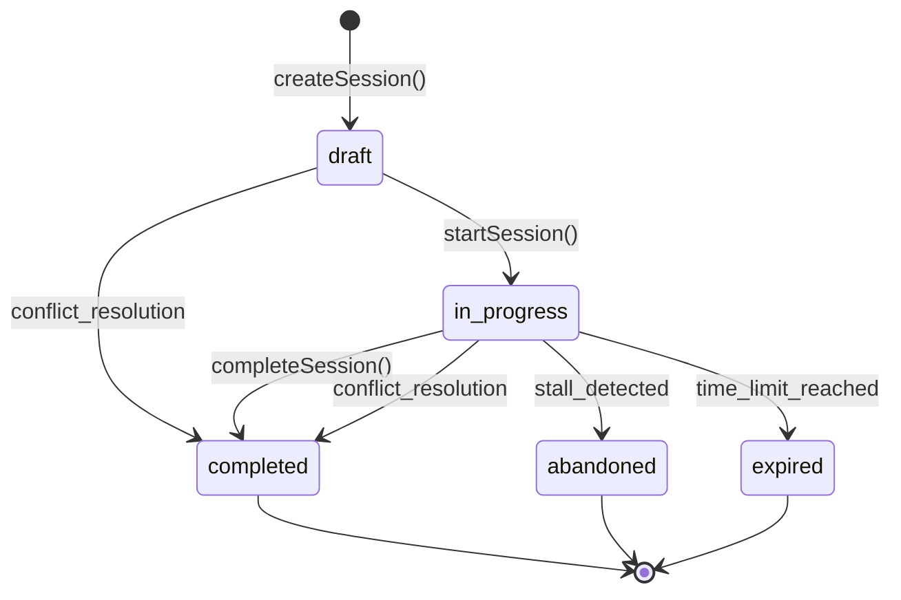

# 🎯 Session Management System

## Overview

CodeMaster's session management system is a sophisticated learning engine that prevents session conflicts, handles different session types, and maintains learning continuity through intelligent state management.

## 🚨 Core Principle: "One Active Session Per Type"

The fundamental rule governing session management:

**Only ONE session of each type can be active (in_progress or draft) at any time.**

Session types include:
- `adaptive` - Regular adaptive learning sessions
- `interview` - Interview practice sessions  
- `review` - Spaced repetition review sessions
- `focused` - Tag-specific focused practice

---

## 🔄 Session Conflict Resolution

### The Problem
Without conflict resolution, users could have multiple active sessions of the same type, leading to:
- Data inconsistency
- Confusing UI states
- Progress tracking errors
- Session limbo states

### The Solution
**Automatic Session Conflict Resolution** implemented in `sessionService.js:45-85`:

```javascript
// Enforce one active session per type: mark existing in_progress/draft sessions as completed
const existingInProgress = await getLatestSessionByType(sessionType, "in_progress");
if (existingInProgress) {
  logger.info(`⏹️ Marking existing in_progress ${sessionType} session as completed`);
  existingInProgress.status = "completed";
  existingInProgress.lastActivityTime = new Date().toISOString();
  await updateSessionInDB(existingInProgress);
}

const existingDraft = await getLatestSessionByType(sessionType, "draft");
if (existingDraft) {
  logger.info(`📝 Marking existing draft ${sessionType} session as completed`);
  existingDraft.status = "completed"; 
  existingDraft.lastActivityTime = new Date().toISOString();
  await updateSessionInDB(existingDraft);
}
```

### Key Features:
- **Automatic Resolution**: No user intervention required
- **Data Preservation**: Existing sessions marked as completed, not deleted
- **Comprehensive Logging**: Full audit trail of session state changes
- **Type-Specific**: Each session type managed independently

---

## 📊 Session Lifecycle

### Session States
1. **draft** - Session created but not started
2. **in_progress** - Session actively being worked on
3. **completed** - Session finished normally
4. **abandoned** - Session left incomplete (via stall detection)
5. **expired** - Session expired due to time limits

### State Transitions



---

## 🕒 Session Stall Detection

### Purpose
Prevents users from getting stuck with "dead" sessions that will never be completed.

### Detection Criteria
- **Interview Sessions**: 3 hours of inactivity
- **Regular Sessions**: 6 hours of inactivity  
- **Draft Sessions**: 24 hours without starting

### Implementation
Located in `sessionService.js:classifySessionState()`:

```javascript
const getSessionStalenessThreshold = (sessionType) => {
  const baseThresholds = {
    'interview': 3 * 60 * 60 * 1000,      // 3 hours
    'full-interview': 3 * 60 * 60 * 1000, // 3 hours  
    'adaptive': 6 * 60 * 60 * 1000,       // 6 hours
    'review': 6 * 60 * 60 * 1000,         // 6 hours
    'focused': 6 * 60 * 60 * 1000         // 6 hours
  };
  return baseThresholds[sessionType] || baseThresholds['adaptive'];
};
```

### Stall Recovery
When a session is detected as stalled:
1. **UI Banner**: `SessionRegenerationBanner` appears
2. **Auto-Completion**: Session marked as completed after extended staleness
3. **New Session**: User can generate fresh session immediately

---

## 🎭 Interview Session Management  

### Special Characteristics
- **Shorter Timeouts**: 3-hour staleness detection vs 6 hours for regular sessions
- **Time-Sensitive**: Designed for interview practice under time pressure
- **Priority Handling**: Interview sessions get higher priority in conflict resolution

### Interview Session Types
- `interview` - Standard interview practice
- `full-interview` - Extended interview simulation

### Implementation Details
```javascript
// Enhanced session classification for interview awareness
const isInterviewSession = (sessionType) => {
  return ['interview', 'full-interview'].includes(sessionType);
};

const classifySessionState = (session) => {
  const threshold = getSessionStalenessThreshold(session.sessionType);
  const timeSinceActivity = Date.now() - new Date(session.lastActivityTime);
  
  if (isInterviewSession(session.sessionType)) {
    // Special interview session state classification
    if (timeSinceActivity > threshold) {
      return 'interview_stale';
    }
    return session.status === 'in_progress' ? 'interview_active' : session.status;
  }
  
  // Regular session classification...
};
```

---

## 🛡️ Circuit Breaker Pattern

### Purpose
Provides resilience against failures in enhanced session features by automatically falling back to proven functionality.

### Implementation
```javascript
class HabitLearningCircuitBreaker {
  static isOpen = false;
  static failureCount = 0;
  static MAX_FAILURES = 3;
  static RECOVERY_TIMEOUT = 5 * 60 * 1000; // 5 minutes

  static async safeExecute(enhancedFn, fallbackFn, operationName) {
    if (this.isOpen && this.shouldAttemptReset()) {
      this.reset();
    }
    
    if (this.isOpen) {
      logger.info(`⚡ Circuit breaker OPEN for ${operationName} - using fallback`);
      return await fallbackFn();
    }
    
    try {
      const result = await enhancedFn();
      this.recordSuccess();
      return result;
    } catch (error) {
      this.recordFailure();
      logger.warn(`⚠️ Enhanced ${operationName} failed, using fallback:`, error);
      return await fallbackFn();
    }
  }
}
```

### Usage in Session Service
```javascript
// Example: Safe session creation with fallback
const session = await HabitLearningCircuitBreaker.safeExecute(
  () => createEnhancedSession(params),
  () => createBasicSession(params), 
  "session-creation"
);
```

---

## 🔄 Session Attribution Logic

### Problem Statement
When a user attempts a problem, the system must determine which session (if any) the attempt belongs to.

### Attribution Priority
1. **Guided Sessions**: Check if problem exists in any active guided session
2. **Interview Sessions**: Special handling for interview-aware attribution  
3. **Tracking Sessions**: Fallback for unguided practice

### Implementation Flow
```javascript
// Session Attribution Engine
const attributeAttemptToSession = async (problemId) => {
  // 1. Check guided sessions first (highest priority)
  const guidedSession = await findGuidedSessionForProblem(problemId);
  if (guidedSession) {
    return { sessionId: guidedSession.id, type: 'guided' };
  }
  
  // 2. Check interview sessions
  const interviewSession = await findInterviewSessionForProblem(problemId);
  if (interviewSession) {
    return { sessionId: interviewSession.id, type: 'interview' };
  }
  
  // 3. Create/use tracking session (fallback)
  const trackingSession = await getOrCreateTrackingSession();
  return { sessionId: trackingSession.id, type: 'tracking' };
};
```

### Key Features
- **Problem Matching**: Supports multiple problem ID formats (id, leetCodeID, problemId)
- **Debugging Support**: Comprehensive logging for troubleshooting attribution failures
- **Fallback Safety**: Always provides a valid session for attempt tracking

---

## 📈 Session Analytics Integration

### Real-Time Updates
Session completion triggers comprehensive analytics updates:

```javascript
const completeSession = async (sessionId) => {
  // 1. Calculate session performance
  const performance = await calculateSessionPerformance(sessionId);
  
  // 2. Update tag mastery based on attempts
  await updateTagMasteryFromSession(sessionId, performance);
  
  // 3. Store detailed analytics
  await storeSessionAnalytics(sessionId, performance);
  
  // 4. Update problem relationships
  await updateProblemRelationships(sessionId);
  
  // 5. Schedule next reviews (FSRS)
  await updateScheduling(sessionId, performance);
};
```

### Analytics Captured
- **Performance Metrics**: Accuracy, timing, difficulty progression
- **Mastery Changes**: Tag strength updates, new masteries achieved
- **Learning Efficiency**: Time per problem, improvement trends
- **Predictive Metrics**: Retention likelihood, next review scheduling

---

## 🔧 Technical Implementation Details

### Key Files
- **`sessionService.js`**: Core session management logic
- **`sessions.js`**: Database operations for session store
- **`SessionRegenerationBanner.jsx`**: UI component for stall recovery
- **`background.js`**: Chrome extension session handlers

### Database Schema
- **sessions store**: Primary session data
- **session_analytics store**: Detailed performance analysis
- **session_state store**: Navigation and UI state

### Chrome Extension Integration
```javascript
// Background script session handlers
case "createSession":
  const session = await SessionService.createSession(request.params);
  sendResponse({ success: true, session });
  break;
  
case "getCurrentSession":
  const currentSession = await SessionService.getCurrentSession();
  sendResponse({ session: currentSession });
  break;
```

---

## 🎯 Best Practices

### Session Creation
- Always use `SessionService.createSession()` - never create sessions directly
- Specify session type explicitly to enable proper conflict resolution
- Include adaptive parameters for personalized difficulty

### Session Management
- Check session state before starting work
- Handle stalled sessions gracefully with regeneration UI
- Maintain session activity timestamps for accurate staleness detection

### Error Handling
- Use Circuit Breaker pattern for enhanced features
- Always have fallback logic for critical session operations
- Log session state changes for debugging

### Performance Optimization  
- Cache active session data to reduce database queries
- Batch session updates when possible
- Use retry mechanisms for critical session operations

---

## 🐛 Troubleshooting

### Common Issues

#### Multiple Active Sessions
**Symptoms**: User sees multiple sessions in progress
**Cause**: Conflict resolution not triggered
**Solution**: Check `sessionService.js:createSession()` for conflict resolution logic

#### Session Stall Detection Not Working
**Symptoms**: Dead sessions not being cleaned up
**Solution**: Verify `lastActivityTime` updates and threshold calculations

#### Attribution Failures
**Symptoms**: Attempts not being assigned to correct sessions
**Solution**: Check problem ID matching logic and session state validation

### Debugging Tools
```javascript
// Enable session debugging
logger.setLevel('debug');

// Check session states
const sessions = await getAllActiveSessions();
console.table(sessions);

// Verify conflict resolution
const conflicts = await findSessionConflicts();
console.log('Session conflicts:', conflicts);
```

---

This session management system ensures reliable, conflict-free learning sessions while providing sophisticated features like stall detection, interview awareness, and comprehensive analytics integration.