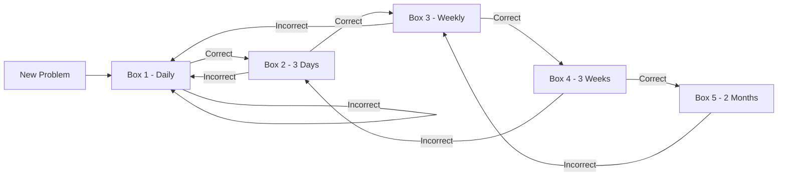

# Leitner Spaced Repetition System

CodeMaster implements a sophisticated spaced repetition system based on the Leitner method combined with modern FSRS (Free Spaced Repetition Scheduler) algorithms for optimal long-term retention.

## Overview

The Leitner system organizes problems into progressive "boxes" based on your mastery level. Problems you answer correctly move to higher boxes with longer review intervals, while incorrect answers move them back to lower boxes for more frequent review.

## Box System Architecture

### Box Levels & Intervals

```javascript
const LEITNER_CONFIG = {
  box1: { interval: 1,     label: "Learning" },      // Daily review
  box2: { interval: 3,     label: "Familiar" },      // Every 3 days  
  box3: { interval: 7,     label: "Known" },         // Weekly
  box4: { interval: 21,    label: "Mastered" },      // Every 3 weeks
  box5: { interval: 60,    label: "Archived" }       // Every 2 months
};
```

### Problem Progression Flow



## FSRS Integration

### Enhanced Scheduling Algorithm

CodeMaster extends the basic Leitner system with FSRS for more personalized scheduling:

```javascript
// FSRS Parameters (learned from your performance)
const fsrsParams = {
  stability: 2.5,      // How well you retain this problem
  difficulty: 6.2,     // Inherent problem difficulty  
  retrievability: 0.9, // Current recall probability
  lapses: 1           // Number of times forgotten
};

// Calculate next review using FSRS
const nextReview = calculateFSRSInterval(fsrsParams, performance);
```

### Adaptive Scheduling Benefits

- **Personalized Intervals**: Learns your individual forgetting curve
- **Difficulty Adjustment**: Harder problems get more frequent reviews
- **Performance Tracking**: Adapts based on your success patterns
- **Optimal Timing**: Reviews scheduled at optimal memory decay points

## Database Implementation

### Problem Schema with Leitner Data

```javascript
// problems store schema
{
  leetCodeID: "two-sum",
  title: "Two Sum",
  difficulty: "Easy",
  tags: ["Array", "Hash Table"],
  
  // Leitner System Fields
  boxLevel: 3,                    // Current box (1-5)
  stability: 4.2,                 // FSRS stability score
  difficulty: 5.8,                // FSRS difficulty score  
  retrievability: 0.85,           // Current recall probability
  lapses: 0,                      // Number of failed reviews
  lastReviewed: 1699123200000,    // Last review timestamp
  nextReview: 1699728000000,      // Next scheduled review
  consecutiveCorrect: 2,          // Streak of correct answers
  totalAttempts: 5,               // All-time attempt count
  totalCorrect: 4                 // All-time success count
}
```

### Session Integration

Sessions automatically incorporate Leitner scheduling:

```javascript
const sessionSettings = {
  reviewMode: "mixed",           // new + review problems
  reviewRatio: 0.3,             // 30% review, 70% new
  prioritizeBoxes: [1, 2],      // Focus on learning/familiar
  minReviewCount: 2,            // Minimum review problems
  respectSchedule: true         // Honor next review dates
};
```

## Review Scheduling Logic

### Daily Review Selection

```javascript
// Get problems due for review
const reviewProblems = await getProblemsForReview({
  dueDate: Date.now(),
  maxCount: 10,
  priorityBoxes: [1, 2], // Focus on lower boxes
  includeOverdue: true   // Include overdue problems
});

// Smart review ordering
const orderedReviews = reviewProblems.sort((a, b) => {
  // Prioritize by urgency and box level
  const urgencyA = calculateReviewUrgency(a);
  const urgencyB = calculateReviewUrgency(b);
  return urgencyB - urgencyA;
});
```

### Performance-Based Progression

```javascript
// Update problem after attempt
async function updateProblemAfterAttempt(problemId, success, timeSpent) {
  const problem = await getProblem(problemId);
  
  if (success) {
    // Move up or maintain box level
    const newBoxLevel = Math.min(5, problem.boxLevel + 1);
    const newStability = calculateFSRSStability(problem, true, timeSpent);
    
    await updateProblemInDB(problemId, {
      boxLevel: newBoxLevel,
      stability: newStability,
      consecutiveCorrect: problem.consecutiveCorrect + 1,
      lastReviewed: Date.now(),
      nextReview: calculateNextReview(newStability, newBoxLevel)
    });
  } else {
    // Move down to box 1 for re-learning
    await updateProblemInDB(problemId, {
      boxLevel: 1,
      stability: Math.max(0.5, problem.stability * 0.8), // Reduce stability
      consecutiveCorrect: 0,
      lapses: problem.lapses + 1,
      lastReviewed: Date.now(),
      nextReview: Date.now() + (24 * 60 * 60 * 1000) // Review tomorrow
    });
  }
}
```

## Advanced Features

### Adaptive Session Creation

Sessions intelligently balance new learning with spaced repetition:

```javascript
const adaptiveSession = await createAdaptiveSession({
  targetCount: 10,
  learningGoals: ["Array", "Hash Table"],
  reviewPriority: "balanced",     // balanced, review-heavy, learning-heavy
  difficultyRange: ["Easy", "Medium"],
  includeOverdue: true,
  minBoxDistribution: {           // Ensure variety across boxes
    box1: 2,  // At least 2 learning problems
    box2: 1,  // At least 1 familiar problem  
    box3: 1   // At least 1 known problem
  }
});
```

### Mastery Graduation

Problems can "graduate" from the system once fully mastered:

```javascript
// Graduation criteria
const graduationCheck = {
  minBoxLevel: 5,              // Must reach highest box
  minConsecutiveCorrect: 3,    // 3 consecutive successes in box 5
  minStability: 8.0,           // High FSRS stability score
  maxRecentLapses: 0           // No recent failures
};

// Auto-graduate qualified problems
if (meetsGraduationCriteria(problem, graduationCheck)) {
  await graduateProblem(problem.leetCodeID);
  // Problem removed from active rotation but stats preserved
}
```

### Performance Analytics

Track your progress through the Leitner system:

```javascript
// Box distribution analytics
const analytics = await getLeitnerAnalytics();
/*
Returns:
{
  boxDistribution: { box1: 45, box2: 23, box3: 12, box4: 8, box5: 3 },
  averageStability: 3.2,
  graduationRate: 0.15,        // 15% of problems graduated
  reviewAccuracy: 0.78,        // 78% review success rate
  optimalLoad: 8,              // Recommended daily review count
  trends: {
    weeklyProgress: [2, 3, 5, 4, 6], // Problems promoted per week
    retentionRate: 0.85               // Long-term retention
  }
}
*/
```

## User Interface Integration

### Visual Box Indicators

Problems display their current Leitner status:

```jsx
const LeitnerBadge = ({ boxLevel, nextReview, stability }) => (
  <div className={`leitner-badge box-${boxLevel}`}>
    <span className="box-level">Box {boxLevel}</span>
    <span className="next-review">
      {formatNextReview(nextReview)}
    </span>
    <div className="stability-bar">
      <div 
        className="stability-fill" 
        style={{ width: `${Math.min(100, stability * 10)}%` }}
      />
    </div>
  </div>
);
```

### Review Dashboard

Dedicated review interface for spaced repetition:

```jsx
const ReviewDashboard = () => {
  const { reviewsToday, overdue, upcoming } = useLeitnerSchedule();
  
  return (
    <div className="review-dashboard">
      <ReviewStats 
        due={reviewsToday.length}
        overdue={overdue.length}
        upcoming={upcoming.length}
      />
      <ReviewQueue problems={reviewsToday} />
      <ScheduleCalendar upcoming={upcoming} />
    </div>
  );
};
```

## Configuration Options

### Customizable Parameters

Users can adjust Leitner system behavior:

```javascript
const leitnerSettings = {
  // Box progression speed
  promotionThreshold: 1,        // Correct answers needed to advance
  demotionPolicy: "resetToBox1", // or "dropOneLevel"
  
  // Review scheduling
  maxDailyReviews: 15,          // Daily review limit
  reviewTimeWindow: "morning",   // Preferred review time
  weekendReviews: true,         // Include weekends
  
  // FSRS customization  
  learningCurve: "moderate",    // conservative, moderate, aggressive
  difficultyWeighting: 0.7,     // How much difficulty affects scheduling
  stabilityDecay: 0.95,         // Forgetting curve steepness
  
  // Graduation settings
  autoGraduation: true,         // Automatically graduate mastered problems
  graduationCriteria: "strict"  // strict, moderate, lenient
};
```

### Performance Tuning

Optimize the system for different learning goals:

```javascript
// For interview prep (aggressive learning)
const interviewMode = {
  maxBoxLevel: 4,              // Skip long-term retention box
  promotionThreshold: 1,       // Quick advancement
  reviewRatio: 0.4,            // 40% review, 60% new
  focusTags: ["Array", "String", "Hash Table"]
};

// For long-term mastery (conservative approach)  
const masteryMode = {
  maxBoxLevel: 5,              // Use all boxes
  promotionThreshold: 2,       // Require 2 correct for advancement
  reviewRatio: 0.6,            // 60% review, 40% new  
  stabilityTarget: 6.0         // High retention target
};
```

## Algorithm Implementation

### Core Leitner Functions

Located in `chrome-extension-app/src/shared/utils/leitnerSystem.js`:

```javascript
// Calculate next review interval
export const calculateNextInterval = (boxLevel, stability, performance) => {
  const baseInterval = LEITNER_CONFIG[`box${boxLevel}`].interval;
  const stabilityModifier = Math.max(0.5, stability / 5.0);
  const performanceBonus = performance.accuracy > 0.8 ? 1.2 : 1.0;
  
  return baseInterval * stabilityModifier * performanceBonus * 24 * 60 * 60 * 1000;
};

// Update FSRS parameters after attempt
export const updateFSRSParams = (currentParams, success, difficulty, responseTime) => {
  // FSRS algorithm implementation
  // Updates stability, difficulty, and retrievability based on performance
};

// Determine optimal daily review load
export const calculateOptimalLoad = (userStats, availableTime) => {
  const { avgTimePerProblem, reviewAccuracy, currentBoxDistribution } = userStats;
  const reviewEfficiency = reviewAccuracy * 0.8 + 0.2; // Weight accuracy
  
  return Math.floor((availableTime * reviewEfficiency) / avgTimePerProblem);
};
```

## Best Practices

### Effective Review Habits

1. **Consistent Daily Reviews**: Better than sporadic long sessions
2. **Mix New and Review**: Balance learning with retention
3. **Honor the Schedule**: Don't skip overdue reviews
4. **Focus on Weak Areas**: Prioritize low-box problems
5. **Trust the System**: Let algorithms optimize your schedule

### Common Pitfalls to Avoid

- **Review Procrastination**: Overdue problems compound quickly  
- **Box Rushing**: Don't manually promote problems without earning it
- **Schedule Overriding**: Respect the calculated intervals
- **Perfectionism**: Some forgetting is normal and helps long-term retention

### Integration with Other Features

The Leitner system works seamlessly with other CodeMaster features:

- **Pattern Ladders**: Ladder progression influences box advancement
- **Tag Mastery**: Box levels contribute to overall tag mastery scores  
- **Adaptive Sessions**: Session difficulty adapts to box distribution
- **Strategy Hints**: Review problems get contextual hints based on past mistakes

## Performance Impact

The Leitner system is designed for efficiency:

- **Memory Usage**: Lightweight metadata per problem (~200 bytes)
- **Query Performance**: Indexed by nextReview date for fast scheduling
- **Background Processing**: FSRS calculations are async and non-blocking
- **Storage Optimization**: Old review data is periodically archived

## Research Foundation

CodeMaster's implementation is based on proven spaced repetition research:

- **Ebbinghaus Forgetting Curve**: Models natural memory decay
- **Leitner System**: Proven effectiveness in flashcard learning
- **FSRS Algorithm**: Modern improvements over traditional methods
- **Cognitive Load Theory**: Optimizes problem presentation timing

The system adapts these principles specifically for algorithm learning, where understanding patterns and building problem-solving intuition requires different scheduling than traditional memorization.