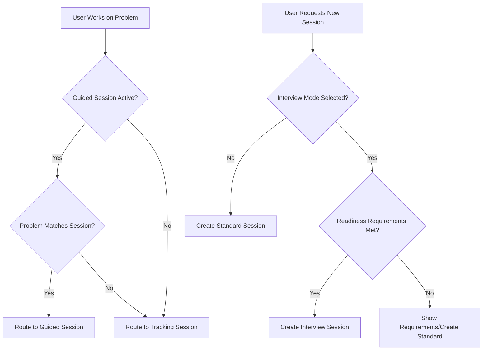
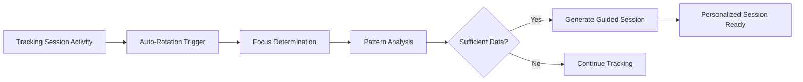

# 📚 Session Types Overview

## Introduction

CodeMaster uses four distinct session types to provide a comprehensive learning experience that adapts to different study contexts and learning goals. Each session type is optimized for specific learning outcomes and user behaviors.

## 🎯 Session Types Matrix

| Feature | Standard | Interview-Like | Full-Interview | Tracking |
|---------|----------|---------------|----------------|----------|
| **Purpose** | Adaptive learning with spaced repetition | Interview prep with mild pressure | Realistic interview simulation | Independent problem exploration |
| **Problem Selection** | Spaced repetition + new problems | Mastery-based (60/30/10 mix) | Mastery-based (60/30/10 mix) | Any problems solved independently |
| **Session Length** | Adaptive (5-8 problems) | 3-5 problems | 3-4 problems | Auto-rotating (up to 12 attempts) |
| **Hints Available** | Unlimited | Maximum 2 per problem | None | Unlimited |
| **Time Pressure** | None | Mild (1.5x allowance) | Strict interview timing | None |
| **UI Mode** | Full feature set | Pressure indicators | Minimal clean interface | Standard |
| **Readiness Requirement** | None | 70%+ accuracy, 3+ mastered tags | 80%+ accuracy, 70%+ transfer score | None |
| **Auto-Complete** | When all problems done | When all problems done | When all problems done | Auto-rotation based on parameters |

## 📖 Detailed Session Types

### 🎓 Standard Sessions
**Primary learning mode for skill building and knowledge retention**

#### Purpose
- Build foundational coding skills through adaptive difficulty progression
- Reinforce learning through scientifically-optimized spaced repetition
- Maintain long-term retention of previously learned concepts

#### Problem Selection Strategy
```javascript
const sessionComposition = {
  reviewProblems: sessionLength * reviewRatio,     // Spaced repetition (default 40%)
  newProblems: sessionLength * (1 - reviewRatio),  // Fresh content (default 60%)
  
  // Adaptive selection based on:
  userFocusAreas: ['arrays', 'dynamic-programming'], // User-selected focus
  currentAllowedTags: ['easy-medium'],               // Difficulty progression
  currentDifficultyCap: 'Medium'                     // Adaptive difficulty limit
};
```

#### Key Features
- **Adaptive Session Length:** 5-12 problems based on performance and preferences
- **Intelligent Review Scheduling:** FSRS algorithm for optimal retention
- **Focus Area Integration:** Emphasizes user-selected weak areas
- **Progress Tracking:** Comprehensive analytics and mastery progression

#### User Journey
1. User requests new session or resumes existing draft
2. System builds session with review + new problems
3. User works through problems with full support features
4. Session completes when all problems are attempted
5. Comprehensive performance analysis and next session planning

---

### 🎯 Interview-Like Sessions
**Interview preparation with controlled pressure and constraints**

#### Purpose
- Bridge gap between learning sessions and real interview conditions
- Build confidence in time-pressured problem solving
- Develop interview-specific skills like verbal explanation and approach planning

#### Readiness Requirements
- **Accuracy:** 70%+ success rate in recent sessions
- **Knowledge Base:** At least 3 mastered algorithm/data structure tags
- **Consistency:** Stable performance over multiple sessions

#### Problem Mix Strategy
```javascript
const interviewLikeMix = {
  mastered: 0.6,      // 60% from mastered tags (confidence builders)
  nearMastery: 0.3,   // 30% from near-mastered tags (skill validation)
  challenging: 0.1    // 10% stretch problems (growth opportunities)
};
```

#### Constraints & Features
- **Hint Limitation:** Maximum 2 hints per problem, no time restrictions on hint usage
- **Time Pressure:** 1.5x normal time allowance with visible pressure indicators
  - Easy: 22 minutes, Medium: 37 minutes, Hard: 60 minutes
- **UI Modifications:** Pressure indicators and interview-focused interface
- **Performance Tracking:** Transfer accuracy, speed delta, hint dependency metrics

---

### 🏆 Full-Interview Sessions
**Realistic interview simulation with strict constraints**

#### Purpose
- Provide authentic interview experience
- Test knowledge transfer under real constraints
- Build confidence for actual technical interviews

#### Advanced Readiness Requirements
- **High Accuracy:** 80%+ success rate in recent sessions
- **Transfer Readiness:** 70%+ transfer score from Interview-Like sessions
- **Proven Consistency:** Demonstrated performance stability

#### Realistic Constraints
```javascript
const fullInterviewConstraints = {
  hints: { max: 0, timeRestriction: true },           // No hints allowed
  timing: { 
    pressure: true, 
    hardCutoff: true,                                 // Enforced time limits
    multiplier: 1.0,                                  // Standard interview timing
    thresholds: { 
      Easy: 15 * 60000,    // 15 minutes
      Medium: 25 * 60000,  // 25 minutes  
      Hard: 40 * 60000     // 40 minutes
    }
  },
  uiMode: 'minimal-clean'                            // Distraction-free interface
};
```

#### Advanced Analytics
- **Transfer Readiness Score (TRS):** Composite metric (0-1) for interview readiness
- **Intervention Need Score (INS):** Areas requiring focused improvement
- **Performance Comparison:** Interview vs. standard session performance deltas

---

### 📈 Tracking Sessions  
**Background capture of independent problem exploration**

#### Purpose
- Ensure no learning activity goes untracked
- Support spontaneous problem exploration without session management overhead
- Analyze independent learning patterns for personalized session generation

#### Automatic Operation
```javascript
// Session Attribution Engine routes problems automatically
const attribution = async (problem) => {
  const guidedSession = await getActiveGuidedSession();
  
  if (guidedSession && isMatchingProblem(guidedSession, problem)) {
    return routeToGuidedSession(problem);
  } else {
    return routeToTrackingSession(problem);  // Fallback for independent work
  }
};
```

#### Auto-Rotation Parameters
```javascript
const rotationTriggers = {
  inactivityThreshold: 2,        // Hours of inactivity
  maxAttempts: 12,              // Problem attempts per session
  dailyBoundary: true,          // New day = new session
  maxTopicCategories: 4         // Topic coherence limit
};
```

#### Intelligence Features
- **Focus Determination:** Analyzes completed session for learning patterns
- **Session Generation:** Creates personalized guided sessions from tracking data
- **Pattern Recognition:** Identifies user exploration preferences and strengths

## 🔄 Session Interactions & Flow

### Session Selection Logic


### Compatibility & Transitions
- **Standard ↔ Tracking:** Seamlessly compatible, can resume interchangeably
- **Interview Modes:** Isolated - each mode creates dedicated session
- **Session Conflicts:** System automatically resolves by completing previous session

### Generated Session Flow


## 🎮 User Experience Guide

### When to Use Each Session Type

#### Choose **Standard Sessions** when:
- Building foundational skills
- Working through learning curriculum systematically
- Want spaced repetition for retention
- Prefer structured, guided learning experience

#### Choose **Interview-Like Sessions** when:
- Preparing for upcoming interviews (2-4 weeks out)
- Building confidence in time-pressured situations
- Ready to test knowledge transfer (70%+ accuracy achieved)
- Want to identify interview preparation gaps

#### Choose **Full-Interview Sessions** when:
- Interview is imminent (1-2 weeks out)
- Achieved high accuracy in Interview-Like mode
- Need realistic interview simulation
- Want to test peak performance under pressure

#### **Tracking Sessions** happen automatically when:
- Exploring problems outside of guided sessions
- Working on specific topics or companies' problems
- Independent study and problem discovery
- The system needs to capture all learning activity

## 🛠️ Technical Implementation

### Session Creation Flow
```javascript
// Unified session creation
const createSession = async (sessionType = 'standard') => {
  // 1. Resolve conflicts (complete existing sessions of same type)
  await resolveSessionConflicts(sessionType);
  
  // 2. Route to appropriate creation logic
  if (sessionType === 'standard') {
    return await ProblemService.createSession();
  } else if (['interview-like', 'full-interview'].includes(sessionType)) {
    return await ProblemService.createInterviewSession(sessionType);
  } else if (sessionType === 'tracking') {
    return await SessionAttributionEngine.createTrackingSession();
  }
};
```

### Database Schema Differences
```javascript
// Standard/Interview sessions
{
  id: string,
  sessionType: 'standard' | 'interview-like' | 'full-interview',
  problems: Problem[],              // Predefined problem set
  attempts: Attempt[],
  status: 'draft' | 'in_progress' | 'completed',
  // Interview-specific fields
  interviewConfig?: InterviewConfig,
  interviewMetrics?: InterviewMetrics
}

// Tracking sessions  
{
  id: string,
  sessionType: 'tracking',
  problems: [],                     // Always empty - ad-hoc problems
  attempts: Attempt[],
  status: 'in_progress',            // Always active until rotation
  metadata: {
    optimalParameters: RotationConfig
  }
}
```

## 🎯 Best Practices

### For Users
1. **Start with Standard:** Build solid foundation before interview practice
2. **Progress Systematically:** Standard → Interview-Like → Full-Interview
3. **Use Tracking Freely:** Explore problems without worrying about session management
4. **Review Analytics:** Use performance data to guide session type selection

### For Developers
1. **Maintain Separation:** Keep session type logic isolated and well-defined
2. **Handle Fallbacks:** All session types should degrade gracefully
3. **Monitor Metrics:** Track session type effectiveness and user progression
4. **Test Transitions:** Ensure smooth compatibility between compatible types

---

This comprehensive session type system provides users with appropriate learning experiences at every stage of their coding journey, from foundational skill building through interview mastery.